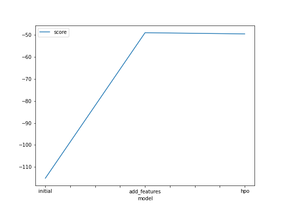
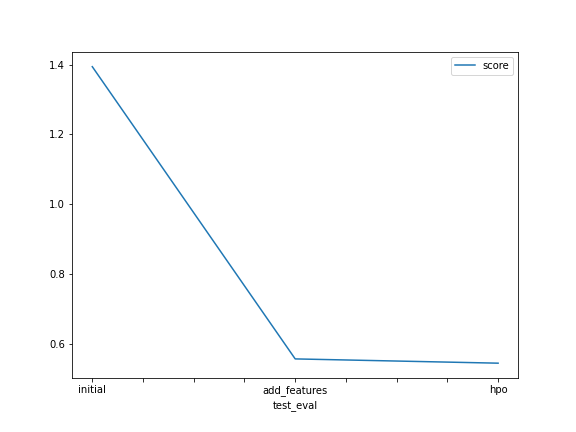

# Report: Predict Bike Sharing Demand with AutoGluon Solution
#### IOANNIS DELIAKOS

## Initial Training
### What did you realize when you tried to submit your predictions? What changes were needed to the output of the predictor to submit your results?
I had to filter out all negative predictions.

### What was the top ranked model that performed?
WeightedEnsemble_L3 was at the top of the leaderboard.

## Exploratory data analysis and feature creation
### What did the exploratory analysis find and how did you add additional features?
The datetime column was not contributing enough as it had no predictive power. Therefore I followed the instructions and and decided to split it by creating 3 new features for hour, day and month accoridngly. Thereafter, the datetime column was dropped since it became redundant. Also, the weather and season attributes were explicitly set as category data type in order to enhance the performance of the model.
### How much better did your model preform after adding additional features and why do you think that is?
Quite a lot! The error was reduced from 1.39 to 0.55, this is a significant improvement!

## Hyper parameter tuning
### How much better did your model preform after trying different hyper parameters?
Just a little bit. Changing the strategy from bayesian which was the default to random enabled more exploration in the hyperparameter space so that eventually it came up with a slightly improved score.

### If you were given more time with this dataset, where do you think you would spend more time?
I would either spend time reading the documentation and learning all about the different parameters that are available, at least for the high-performing models and using grid search I would pick the configuration with the best score. Alternatively, I would replace Autogluon with a more specialized algorithm which is proven to do better on this dataset.

### Create a table with the models you ran, the hyperparameters modified, and the kaggle score.
|model|hpo1|score|
|--|--|--|
|initial|bayesopt|1.39403|
|add_features|bayesopt|0.55592|
|hpo|random|0.54368|

### Create a line plot showing the top model score for the three (or more) training runs during the project.

### Create a line plot showing the top kaggle score for the three (or more) prediction submissions during the project.

## Summary
AutoGluon provides us with an easy way to play around with any dataset and quickly create some benchmark models that are able to inference our label for either a classification or regression task. The library also comes with a rich set of options in case we want to configure the behaviour of the models.